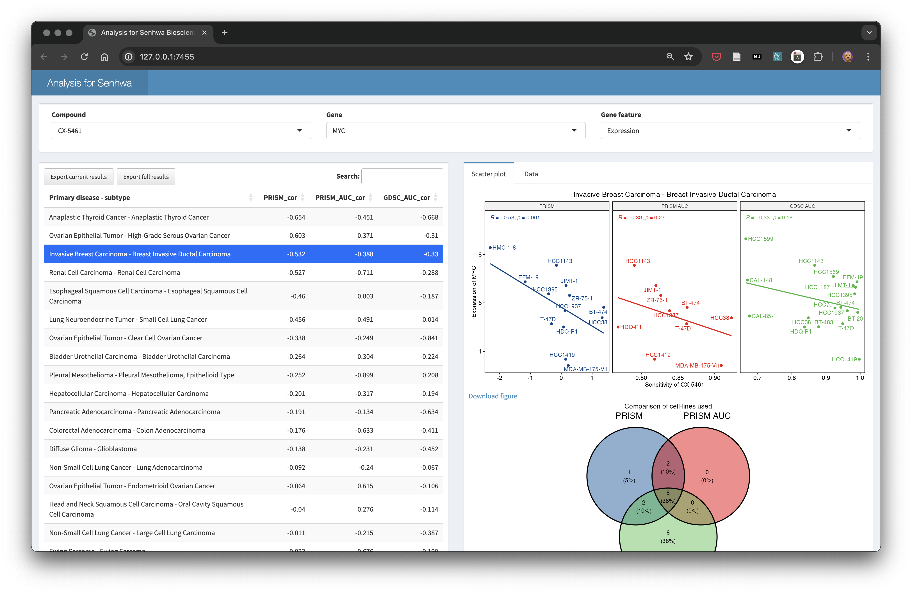

# Bioinformatics Portfolio

This repository serves as a showcase for the bioinformatics applications and pipelines I have developed. It demonstrates my skills in data analysis, visualization, and creating interactive tools for biological research.

## Featured Projects

### 1. Drug Sensitivity and Gene Expression Analysis for Senhwa Biosciences

#### Overview

This Shiny app provides a comprehensive analysis tool for exploring relationships between drug sensitivity and gene expression/copy number across various cancer types. It's designed to assist researchers at Senhwa Biosciences in drug discovery and development processes.

#### Key Features

- **Compound and Gene Selection**: Users can select specific compounds and genes of interest.
- **Multiple Data Sources**: Integrates data from PRISM, PRISM AUC, and GDSC AUC databases.
- **Interactive Visualizations**:
  - Scatter plots showing correlations between drug sensitivity and gene features.
  - Venn diagrams comparing cell lines used across different datasets.
- **Statistical Analysis**: Provides correlation coefficients for each cancer subtype.
- **Data Export**: Options to download figures and data tables for further analysis.

#### Technical Details

- **Framework**: Built using R Shiny
- **Key Libraries**: tidyverse, ggplot2, ggpubr, ggvenn, shinydashboard
- **Data Handling**: Efficient data manipulation using dplyr and tidyr
- **Visualization**: Custom plots created with ggplot2 and its extensions

#### How to Use

1. Select a compound of interest from the dropdown menu.
2. Choose a gene and specify whether to analyze its expression or copy number.
3. Explore the correlation table to identify significant relationships.
4. Click on a specific cancer subtype to view detailed scatter plots and Venn diagrams.
5. Download figures or data tables for further analysis or reporting.

This project showcases my ability to create user-friendly, interactive tools for complex biological data analysis, combining statistical methods with intuitive visualizations to aid in scientific research and drug discovery.

### 2. Single-Cell RNA Sequencing Analysis Pipeline

This repository contains a comprehensive pipeline for analyzing single-cell RNA sequencing (scRNA-seq) data, implemented in both R and Python. The pipeline covers quality control, filtering, normalization, and data transformation steps, providing a versatile toolkit for researchers working with scRNA-seq data.

#### Table of Contents

1. [Overview](#overview)
2. [Pipeline Components](#pipeline-components)
3. [Usage](#usage)
4. [File Descriptions](#file-descriptions)
5. [Dependencies](#dependencies)

#### Overview

This scRNA-seq analysis pipeline is designed to process raw sequencing data, perform quality control, filter low-quality cells and genes, normalize the data, and prepare it for downstream analyses. The pipeline is implemented in both R and Python, allowing users to choose their preferred language or compare results between the two implementations.

#### Pipeline Components

1. **Quality Control and Filtering**
   - Implemented in R (`01_scRNAseq_QC_and_filtering.R`) and Python (`01_scRNAseq_QC_and_filtering.py`)
   - Filters cells based on library size, number of features, and mitochondrial percentage
   - Provides visualizations of QC metrics (R version)
   - Allows flexible parameter setting for QC thresholds

2. **Normalization and Data Transformation**
   - Implemented in R (`02_scRNAseq_normalization.R`) and Python (`02_scRNAseq_normalization.py`)
   - Normalizes UMI counts using various methods:
     - Deconvolution method (R)
     - Log-normalization (Python)
   - Applies variance stabilization using sctransform (R version)
   - Visualizes data before and after normalization (R version)

#### Usage

1. **Quality Control and Filtering:**
   - R: Run `01_scRNAseq_QC_and_filtering.R`
   - Python: Use functions in `01_scRNAseq_QC_and_filtering.py`

2. **Normalization and Data Transformation:**
   - R: Run `02_scRNAseq_normalization.R`
   - Python: Use `log_normalize` function from `02_scRNAseq_normalization.py`

#### File Descriptions

- `scripts/scRNA_analysis/01_scRNAseq_QC_and_filtering.R`: R script for quality control and filtering
- `scripts/scRNA_analysis/01_scRNAseq_QC_and_filtering.py`: Python script for quality control and filtering
- `scripts/scRNA_analysis/02_scRNAseq_normalization.R`: R script for normalization and data transformation
- `scripts/scRNA_analysis/02_scRNAseq_normalization.py`: Python script for normalization

#### Dependencies

##### R Libraries

- scater
- scran
- sctransform
- DropletUtils
- tidyverse
- BiocParallel
- patchwork
- ggplot2
- ensembldb
- AnnotationHub

##### Python Libraries

- scanpy
- anndata
- numpy

Please ensure all dependencies are installed before running the scripts. You can install R packages using `install.packages()` or `BiocManager::install()` for Bioconductor packages. For Python, you can use `pip install` to install the required libraries.

This pipeline provides a comprehensive approach to scRNA-seq data analysis, offering flexibility in language choice and methods. It's designed to be adaptable to various experimental designs and can be easily integrated into larger bioinformatics workflows.
